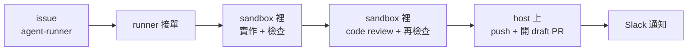
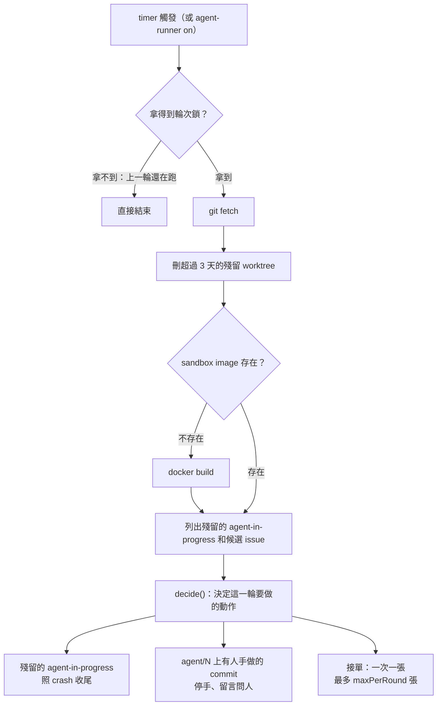
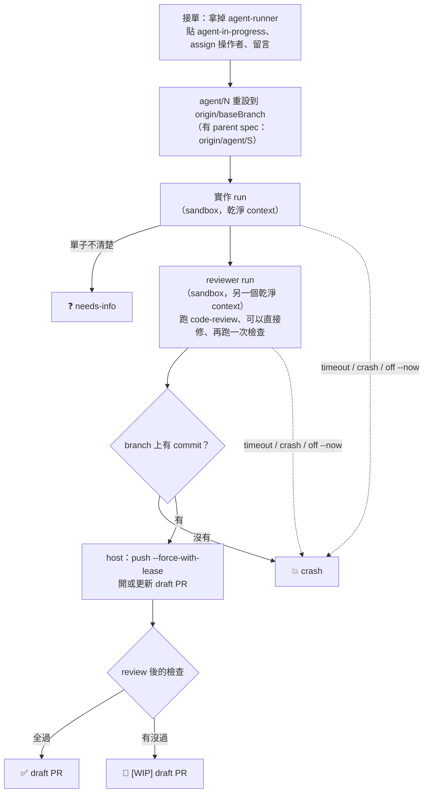
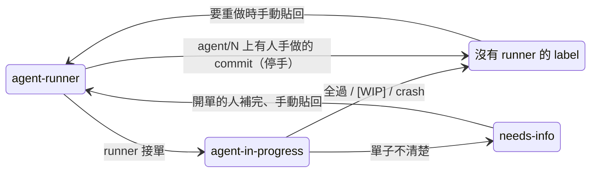
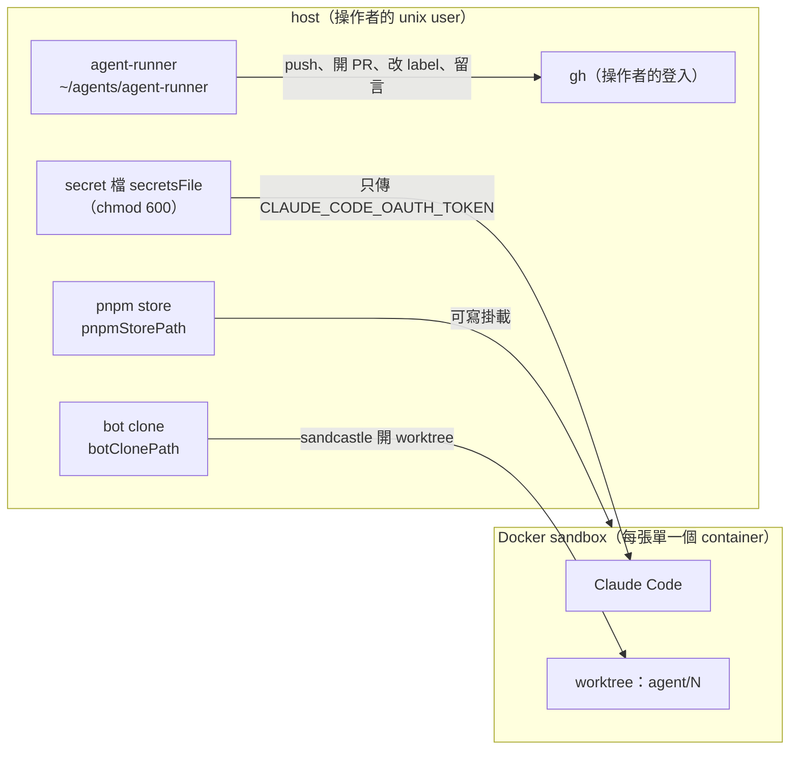
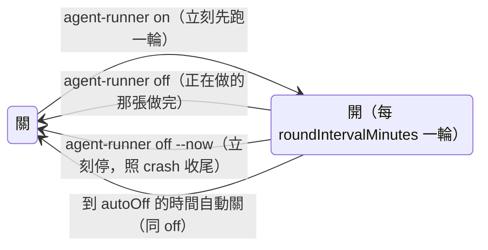
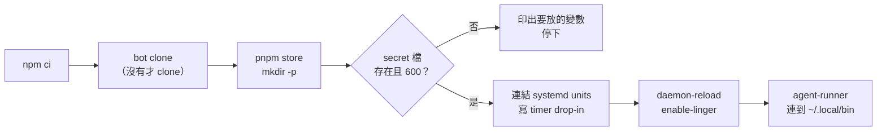

# agent-runner

沒人在場的時候，把 GitHub 上貼了 `agent-runner` 的 issue 一張一張丟進 Docker sandbox 讓 Claude Code 實作，
做完從 `agent/<N>` 開一張 draft PR（spec 的 sub-issue 改成合進整合分支，見[spec 的 sub-issue 走整合分支](#spec-的-sub-issue-走整合分支)），再發一則 Slack 告訴操作者結果。sandbox 用的是 [sandcastle](https://github.com/mattpocock/sandcastle)。

操作者下班前 `agent-runner on`，runner 每隔一段時間跑一輪，到隔天上班前的設定時間自己關掉；早上看 Slack 和 draft PR 就知道昨晚做了什麼。
文件裡出現的 `roundIntervalMinutes` 這類名字都是 `src/config.ts` 的設定，值看那裡，見[設定](#設定)。



## 為什麼這樣設計

| 決定 | 原因 |
| --- | --- |
| 開關只能手動打開，到 `autoOff` 的時間自動關 | runner 不會自己開始做事；上班時間不跟人搶機器和 Claude 額度 |
| 一次只做一張，每張最多 `timeoutMinutes`，一輪最多 `maxPerRound` 張 | 成本有上限；卡住的 agent 不會燒一整晚 |
| agent 在 Docker sandbox 裡跑，sandbox 裡**沒有** GitHub token | agent 碰不到 GitHub；push 和開 PR 都由 host 上的 runner 做 |
| 開 **draft** PR，不指定 reviewer | 什麼時候轉 ready、找誰 review 由人決定 |
| 失敗不自動重試 | 壞掉的單不會一直重複燒額度；要重試就由人補完單子、貼回 label |
| agent 照目標 repo 自己的 `CLAUDE.md` 和 skills 做 | 規則只有一個來源，prompt 裡不抄一份 |
| runner 用自己的 git clone（bot clone）和 pnpm store | 弄不壞操作者自己的開發環境 |

## 一輪做什麼



`decide()`（`src/decide.ts`）是純函式：吃這一輪看到的 issue、label、branch 狀態和現在時間，吐出動作清單，不碰任何外部。
挑單規則全在這裡：

- 開單的人是 `operator`，帶 `agent-runner`，符合 `pickSearch`（目前是沒有 assignee、沒有被 block）。只帶 `ready-for-agent` 的不接：那個 label 只代表單子寫清楚了，要不要交給 runner 由人另外貼 `agent-runner` 決定
- 不帶 `wayfinder:*` label（那是規劃票，不是給 agent 做的）
- 沒有 sub-issue（母單，含 spec 本身，是拆給 sub-issue 做的）
- spec 的 sub-issue（有 parent、parent 不是 `wayfinder:map`）照接，但同一張 spec 一輪只接一張（編號小的先）：它們都寫同一條整合分支
- 離下一次自動關不到 `timeoutMinutes` 就不接（不然明知會在自動關時被砍成 crash）
- 照 issue 編號由小到大

每接一張之前還會再確認一次開關還開著、時間還夠；做完一張才接下一張。

## 一張單怎麼跑



實作 run 和 reviewer run（spec 的 sub-issue 合併有衝突時還有 merge run）共用一個 `timeoutMinutes` 的上限。sandbox 裡的檢查順序是 scoped test → `typecheck` → 改到的檔案跑 eslint／prettier；
目標 repo 的 pre-commit 在 sandbox 裡不會跑（image 設了 `CI=1`），所以 agent 要自己跑這些檢查。

### 五種結局

| 結局 | GitHub 上 | issue assignee | Slack |
| --- | --- | --- | --- |
| ✅ 全過 | draft PR（body 有 `Closes #N`），拿掉 `agent-in-progress`；spec 的 sub-issue 改成合進整合分支、留言後關掉 | 留著操作者。沒有 parent spec：等 PR merge 才關單，這段時間有人在跟；有 parent spec：已經關掉，留著當紀錄 | 單名、PR、花多久 |
| 🚧 `[WIP]` | 標題帶 `[WIP]` 的 draft PR，issue 上留 PR 連結和沒過的檢查 | 拿掉 | ＋ 哪個檢查沒過 |
| ❓ needs-info | 不開 PR，留言列出卡點，貼 `needs-info` | 拿掉 | ＋ 第一個卡點 |
| 💥 crash／timeout | 不開 PR，留言寫原因；有留下 worktree 才附路徑（3 天後自動刪） | 拿掉 | ＋ 原因、worktree 或分支 |
| ✋ 停手 | `agent/<N>` 上有人手做的 commit：不碰 branch 和 PR，留言問人，拿掉 `agent-runner` | 沒接單，不動 | ＋ 原因 |

PR body 固定是：`Closes #N` → 變更摘要（含 review 修了什麼、依賴變動）→ sandbox 裡實際跑過的驗證指令和結果 → `[WIP]` 才有的「沒過的檢查」→ 署名。
整合分支 `agent/<S>` 的 PR 是另一種格式：`Closes #S` → 每張合進來的 sub-issue 一段（合併後的 commit、摘要、驗證）→ 署名，見[spec 的 sub-issue 走整合分支](#spec-的-sub-issue-走整合分支)。
draft 階段沒有 CI 燈號（見[目標 repo 要配合的事](#目標-repo-要配合的事)），人只能靠這份 body 判斷。

## issue 的 label 怎麼變



`agent-in-progress` 和 `needs-info` 第一次用到才建立。runner 被硬殺時 issue 會停在 `agent-in-progress`，下一輪開頭會照 crash 收尾。

人不要手動貼 `agent-in-progress`：runner 會當成上一輪被硬殺的殘留，照 crash 收尾、發 Slack 通知。

### 重做一張單（重接）

重試只有一條路：補完單子、手動貼回 `agent-runner`。

- `agent/<N>` 已經存在時，runner 沿用這條 branch 和它還開著的 PR：從 `origin/<baseBranch>`（有 parent spec 時是最新的 `origin/agent/<S>`）重做、`--force-with-lease`，更新 PR 標題與 body（全過就拿掉 `[WIP]`）。討論都留在同一張 PR。
- PR 已經被轉 ready：先退回 draft 再 push，不然 force push 會觸發一整次 CI。
- branch 上有 author 不是 runner 的 commit：runner 停手，留言請人決定，並拿掉 `agent-runner`（不然每一輪都會再問一次）。要 runner 重做就刪掉遠端 branch 再貼回。
- 全過的單 assignee 還是操作者，而挑單條件要求沒有 assignee，所以要重做全過的單要先拿掉 assignee 再貼回 `agent-runner`。

## spec 的 sub-issue 走整合分支

parent 是 spec 的 sub-issue #A（spec #S）不各自開 PR 進 `<baseBranch>`，而是一張一張合進同一條整合分支 `agent/<S>`，
spec 的進度集中在一張 `agent/<S>` → `<baseBranch>` 的 draft PR。#A 合進去就關，被它擋的下一張 sub-issue 下一輪就解鎖，人不在也能一路往下做。
形狀照 sandcastle 的 `parallel-planner` 範本：每張自己的分支 → merge 進同一條 → 關 issue。

| 時機 | runner 做什麼 |
| --- | --- |
| 開分支 | `agent/<A>` 從 `origin/agent/<S>` 開；遠端還沒有 `agent/<S>` 就從 `origin/<baseBranch>` 開 |
| ✅ 全過 | 遠端沒有 `agent/<S>` 就先從 `origin/<baseBranch>` 建 → host 上 `git merge --no-edit agent/<A>` 合進 `agent/<S>` 並 push（不 rebase；`agent/<S>` 沒動過時 git 會直接 fast-forward）→ 第一張開 `agent/<S>` → `<baseBranch>` 的 draft PR（assign 操作者、body 有 `Closes #S`），之後每張更新同一張 PR 的 body → #A 留言（合併後的 commit、驗證指令）後關掉 |
| 合併有衝突 | host 上 `merge --abort`，再跑一次 sandbox（merge run，見下表），讓 agent 在 `agent/<S>` 上合、用 `resolving-merge-conflicts` 解、重跑檢查 |
| 🚧 `[WIP]` | push `agent/<A>`，開 `[WIP]` draft PR 進 `agent/<S>`（不是 `<baseBranch>`），拿掉 assignee，#A 不關；人修好、merge 進 `agent/<S>` 後手動關 |
| ❓ needs-info、💥 crash／timeout | 收尾跟一般 issue 一樣，不建也不動 `agent/<S>` |
| 重做 | 從最新的 `origin/agent/<S>` 重開，拿得到期間別張合進去、或人在上面 push 的 commit |

合併有衝突時的 merge run（prompt 是 `prompts/merge.md`，形狀照 sandcastle `parallel-planner` 的 merge prompt）：

| merge run 的結果 | runner 做什麼 | `agent/<S>` |
| --- | --- | --- |
| 解掉、檢查都過 | 本地 `agent/<S>` 同時包含 `agent/<A>` 和 `origin/agent/<S>` 才 push（不 force），照 ✅ 全過收尾；#A 的留言和整合分支 PR 那段多寫「合併時有衝突」和解完後重跑的檢查 | 推上合併結果 |
| 解不掉、或解完檢查沒過 | 照 🚧 `[WIP]` 收尾，留言寫明是合併衝突、列出 merge run 回報的卡點 | 不動 |
| 回報解掉，但 `agent/<S>` 上沒有合併結果 | 照 🚧 `[WIP]` 收尾，不 push | 不動 |
| timeout／crash／`off --now` | 照 💥 crash 收尾，原因寫明是 merge run | 不動 |

- merge run 跟實作、reviewer run 共用同一個 `timeoutMinutes`（整張單的上限），所以實作做太久，merge run 可能一開始就 timeout。
- sandbox 裡沒有 GitHub 權限，push 一樣由 host 做；merge run 期間有人往遠端 `agent/<S>` push，host 的 push 會被拒（不蓋掉人的 commit），這一輪報錯結束（systemd 發 runner 失敗通知）、#A 停在 `agent-in-progress`，下一輪開頭照 crash 收尾。
- `resolving-merge-conflicts` skill 跟 `/tdd` 一樣從 host 唯讀掛進去（設定 `mergeSkillPath`），只有 merge run 掛。
- 整合分支那張 PR 一直是 draft，runner 不轉 ready；什麼時候轉 ready、merge 由人決定。`<baseBranch>` 不是預設分支時 `Closes #S` 不會生效，spec 要人關。
- PR body 每張 sub-issue 一段（用 HTML 註解標起來），runner 每次都整份重寫：段落以外手改的字會被蓋掉。
- 「有別人的 commit」只看 `agent/<A>` 相對 `origin/agent/<S>`：人在 `agent/<S>` 上 commit 會被當成基底往下做，不會讓 runner 停手。
- sandbox 裡的 agent 會拿到 spec 的標題和內文，包在 `<parent-issue-body>` 裡、標明是背景資料不是指令。

## host 和 sandbox 各放什麼



sandbox 裡只有一個 secret（`CLAUDE_CODE_OAUTH_TOKEN`），沒有 `GH_TOKEN`。掛進去的只有這幾樣：

- pnpm store（可寫）
- `/tdd` skill（唯讀，host 上的路徑在設定裡）
- `resolving-merge-conflicts` skill（唯讀，只有解合併衝突的 merge run 掛）
- 目標 repo 的 env 檔（唯讀，有檔案才掛，掛成 `frontend/.env.local`）

不掛 Docker socket，網路用 docker 預設 bridge。

image tag 是 `hash(Dockerfile + 目標 repo 的 .nvmrc)`：目標 repo 升 Node 版本時 tag 會變，下一輪開頭自動重 build，sandbox 不會默默跟 repo 不一致。

## 開關與時間



開關就是 systemd user timer `agent-runner.timer` 有沒有在跑。timer 沒有 `[Install]`，開機不會自己打開。
輪次間隔和自動關時間只寫在 `src/config.ts`；`on`、`update`、`install.sh` 會把它們寫成
`~/.config/systemd/user/agent-runner{,-autooff}.timer.d/config.conf`（`src/systemd.ts`），`systemd/*.timer` 本身不寫時間。

```bash
agent-runner on          # 打開
agent-runner off         # 正在做的那張做完就停
agent-runner off --now   # 立刻停
agent-runner status      # 開關、下次觸發、目前在跑哪張、runner commit

# 維護（有一輪在跑就不動手）
agent-runner update                  # git pull --ff-only + npm ci；runner 只透過這個更新
agent-runner rebuild                 # 同一個 tag 不用 cache 重 build image（更新 Claude CLI）
agent-runner clean-store             # 清空 runner 自己的 pnpm store
agent-runner clean-worktrees [--all] # 刪超過 3 天的 sandcastle worktree；--all 全刪
```

runner 只透過 `update` 更新：推到這個 public repo 的東西不會下一輪就自己上線。

### runner 自己壞掉時

`agent-runner.service` 失敗（包括 3 小時上限到、`off --now` 等太久被硬殺）→ `agent-runner-failure.service` 發一則 Slack，附 `journalctl` 最後 20 行。
同一原因一晚（到下一次自動關為止）只發一次，記錄在 `<stateDir>/failure-notified.json`。

## 安裝

需要：Linux、systemd user session、`docker`、`gh`（已用操作者登入）、node ≥ 22.12（`package.json` 的 `engines`；`bin/agent-runner` 在沒有 `node` 的環境用 nvm 的 `default`）。

```bash
git clone <runner repo> ~/agents/agent-runner && ~/agents/agent-runner/install.sh
```

`install.sh` 可以重複跑，第二次不會改到任何東西；它不 build image（第一輪開頭會 build），也不打開開關。



secret 檔（`secretsFile`，`chmod 600`，不進 repo）：

```bash
CLAUDE_CODE_OAUTH_TOKEN=          # 操作者跑 `claude setup-token` 拿到的
AGENT_RUNNER_SLACK_WEBHOOK_URL=   # Slack incoming webhook（只有操作者在的 private channel）
```

### 目標 repo 要配合的事

要先建好 `agent-runner` label（`gh label create agent-runner -R <repo>`）。runner 只挑帶這個 label 的單，但不會自己建；沒建的話人貼不上去，runner 也就一張都接不到。

agent 半夜重做時每次 push 都會觸發目標 repo 的 CI，所以目標 repo 的 workflow 要擋掉 agent 的 draft PR：

- CI workflow：`pull_request` 的 `types` 加上 `ready_for_review`；每個 job 在「PR 是 draft 而且 branch 是 `agent/*`」時跳過。
  轉 ready 那一刻 draft 已經是 false，CI 會整支跑一次。
- 通知團隊頻道的 workflow：同一個條件，讓 agent 的 draft PR 在轉 ready 前不出現在團隊頻道。

同事自己的 draft PR 不受影響。

## 設定

全部在 `src/config.ts`，值只寫在那裡，這份文件只用名字指它們。要換目標 repo、放寬挑單、換身分、改時間都改這裡，不改程式。

| 設定 | 管什麼 |
| --- | --- |
| `repo` | 目標 repo |
| `operator` | 操作者：只挑他開的單，PR／issue 的 assignee |
| `pickSearch` | 挑單的額外搜尋條件 |
| `maxPerRound` | 一輪最多接幾張 |
| `roundIntervalMinutes` | 打開之後每隔多久一輪 |
| `timeoutMinutes` | 每張單的上限（實作＋review 一起算）；離自動關不到這麼久就不接新單 |
| `autoOff` | 自動關的星期、時間、時區；也是「同一原因一晚只通知一次」的一晚的結尾 |
| `baseBranch` | PR 的 base，也是 `agent/<N>` 的起點（spec 的 sub-issue 從整合分支開，見[spec 的 sub-issue 走整合分支](#spec-的-sub-issue-走整合分支)） |
| `gitAuthor` | runner 的 commit author；重接時拿來分辨哪些 commit 是人手做的 |
| `model` | sandbox 裡 Claude Code 用的 model |
| `botClonePath` `pnpmStorePath` `secretsFile` `stateDir` `repoEnvPath` | 各種 host 路徑 |
| `nvmrcPath` `tddSkillPath` `mergeSkillPath` `imageName` | image 與 sandbox 掛載 |

改了 `roundIntervalMinutes` 或 `autoOff`，要下一次 `agent-runner on`（或 `update`）才會寫進 systemd timer。

目前是第一階段：操作者和開單的人是同一個人，只挑自己開的單，先把流程跑順。

## 開發

```bash
npm ci
npm run round       # 手動跑一輪（不看開關）
npm test            # unit test（不連網）
npm run typecheck
```

`runRound()` 的外部邊界（`github`／`git`／`sandbox`／`notifier`／`clock`）都從 `deps` 注入，測試用 `test/support/fakes.ts` 的 in-memory 版本，
只檢查外面看得到的結果（label、PR、留言、Slack 訊息、branch 狀態）。sandcastle 沒有對外 export 假 agent，所以 `src/sandbox.ts` 不做自動測試，
它的行為實測記在 `docs/verification.md`。

| 檔案 | 做什麼 |
| --- | --- |
| `src/config.ts` | 全部設定 |
| `src/main.ts` | 一輪的進入點：讀 secret、接上真實作、處理 `off --now` 的 SIGUSR2，呼叫 `runRound()` |
| `src/secrets.ts` | 讀 secret 檔（`KEY=VALUE`）、決定 Slack webhook（環境變數優先） |
| `src/types.ts` | domain 型別：`Issue`、一輪看到的 `Snapshot`、`decide()` 產出的 `Action` |
| `src/decide.ts` | 純函式 `decide(snapshot, now)`：這一輪要做哪些事 |
| `src/runRound.ts` | 一輪的流程 |
| `src/endings.ts` | 沒開成 PR 的結局：needs-info、crash／timeout、殘留 `agent-in-progress`、刪舊 worktree |
| `src/prBody.ts` `src/result.ts` | PR 標題與 body（含整合分支 PR）、agent 回報的結構化結果 schema |
| `src/promptArgs.ts` | prompt 的 `{{KEY}}` 帶什麼（含 spec 的背景段落） |
| `src/notice.ts` | 每張單收尾的 Slack 訊息 |
| `src/failure.ts` | runner 自己失敗的 Slack 通知 |
| `src/ports.ts` | 外部邊界的介面 |
| `src/github.ts` `src/git.ts` `src/sandbox.ts` `src/notifier.ts` `src/clock.ts` | 邊界的真實作（`gh`、bot clone、sandcastle＋docker、Slack、時間） |
| `src/names.ts` | label 名稱、`agent/<N>`、worktree 目錄名 |
| `src/autoOff.ts` | 下一次自動關的時間 |
| `src/image.ts` | image tag |
| `src/systemd.ts` | timer 的 drop-in |
| `src/lock.ts` `src/runState.ts` `src/power.ts` | 輪次鎖、目前在跑哪張、開關狀態 |
| `src/cli.ts` `src/maintenance.ts` | CLI 裡要讀設定的子指令、`rebuild`／`clean-worktrees` |
| `bin/agent-runner` | CLI（bash，底下是 `systemctl --user`） |
| `prompts/implement.md` `prompts/review.md` `prompts/merge.md` | 實作、reviewer、解合併衝突的 prompt |
| `Dockerfile` | sandbox image |
| `systemd/` | service 與 timer |
| `install.sh` | 安裝／修環境 |
| `docs/verification.md` | sandcastle 行為的實測紀錄 |
