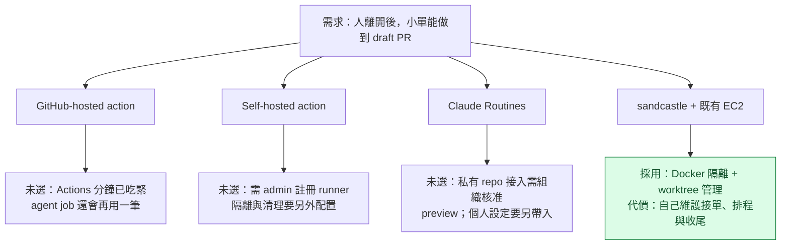
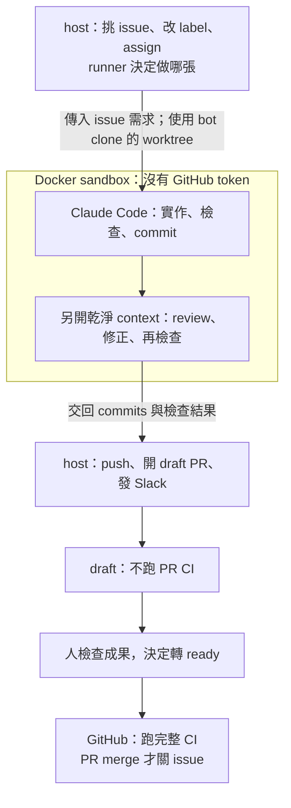
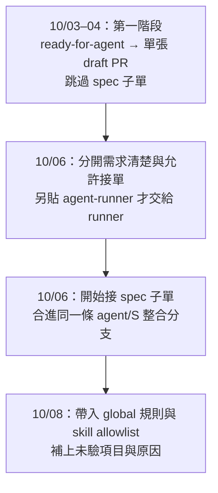

# 為什麼選 sandcastle + company-ec2

這是 2026-10-03–04 建立 agent-runner 前的選型紀錄，於 2026-10-09 補進 repo。當時已比較 Claude Code Routines 與 claude-code-action，最後選擇 **sandcastle + company-ec2 Docker，由 host 程式接單、push 與開 draft PR**。

這個決定解決的是既有主機、Actions 分鐘、組織授權與隔離需求，不代表 Claude Code 沒有無人值守能力。現在怎麼操作以 [README](../README.md) 為準；原始研究裡的估算、未驗項目與當時功能限制，不當成今日的實測結果。文末另有 [2026-10-09 重新評估](#2026-10-09-重新評估)，收錄這次查到的官方替代能力。

## 研究範圍

原始研究與 spec 留在 private 工作紀錄，本文件整理可公開的決策摘要，閱讀不需要存取那些紀錄。研究涵蓋工具可行性、替代方案、部署位置、接單到 PR 的流程、成本護欄、通知與失敗收尾，之後才定案第一階段 spec。

## 當時要解決的問題

有一批已寫清楚的小 issue，不需要人在場決策，卻仍得由人逐張開 session、實作、驗證與開 PR。第一階段只做操作者自己的單，先把流程跑順，不追求秒級反應或多人共用。

第一階段的限制與需求：

- GitHub Actions 分鐘已吃緊，不能只比較模型費用，也要計算 agent job 與 PR CI。
- company-ec2 已有 Docker 與操作者登入的 `gh`；bot 不使用操作者日常開發的 checkout。
- 手動打開、早上自動關；每輪與每張單都有上限，避免佔用白天的機器與訂閱額度。
- 產出 draft PR，由人決定何時轉 ready；失敗不自動重試。
- sandbox 只拿 Claude token，GitHub 寫入與 Slack 通知交給 host。

## 原始方案的取捨

四條路都能讓 agent 做事；當時選的是下面這組取捨。

action 能用 issue label 精準觸發、訂閱 OAuth token 與 repo 規則；GitHub-hosted agent job 會額外消耗 Actions 分鐘，當時沒有實測每張單的分鐘數。Self-hosted 不是不能加 Docker，而是當時選擇直接使用 sandcastle 的隔離與 worktree 管理。

Routines 當時已能雲端無人值守，支援排程／API／PR／Release 觸發，也讀得到 repo 規則；缺的是 issue event，需輪詢或 API bridge。它與 sandcastle 都不消耗 agent 那段的 Actions 分鐘。

**Routines 的輪詢頻率不是單獨的否決理由**：最後 runner 本身也採每小時一輪。真正要重新比較的是組織授權、環境配置與自訂流程的維護成本。當時 Routines 研究也列出 PR trigger bug，但沒有把它當成 schedule 輪詢一定失敗的證據。

**選 sandcastle 不會省掉 PR 之後的 CI**。三條路都可能產生相同的 PR CI 成本；移到 EC2 只避免 agent 執行那段使用 GitHub-hosted 分鐘。因此另外決定跳過 `agent/*` draft 的 CI，轉 ready 才跑完整 CI，減少重做或未採用成果產生的 CI 次數。

原始選型來源沒有 Codex 對照研究，因此不補寫「當時不選 Codex」的理由；本次 Codex 比較列在文末的重新評估。

## 為什麼還需要 runner 程式

sandcastle 模板只能當骨架。**runner 管接單與 GitHub，Claude Code 管實作**。下圖畫第一階段成功的路徑：

獨立 clone 與 `branch` strategy 保護操作者日常使用的 checkout；實作和 reviewer 共用整張單的 timeout，避免「一直有輸出但跑很久」。runner 不沿用模板「commit 完就關單」的行為。

失敗由 host 區分 WIP、needs-info、crash 並通知操作者，不自動重試；人補完需求後再交單。這些是 runner 額外管理的流程，Claude Code 的 tool loop 仍由 Claude Code 提供。

## 為什麼另開 repo，不放產品 repo 或 chezmoi

最後定案為個人的 **public** runner repo；早期 private runner repo／chezmoi 部署的草案沒有採用。

- 不放產品 repo：調 runner prompt 不必每次經產品 repo 的 PR；runner 有自己的 dependencies 與 lockfile。sandbox 仍讀目標 repo 的規則，避免在 public runner 抄一份內部規則。
- 不放 chezmoi：只有一台部署主機，systemd units 與安裝腳本一起放 runner；public dotfiles 為一個 token 檔增加加密部署不划算。
- secret 手動放主機、不 commit；bot clone 只放目標 repo 與 runtime 產物。

## 第一階段落地與後續變更

**先做單張 PR，後來才加整合分支與共用個人規則**。不要把後來的功能當成最初選型原因：

後續變更可查本 public repo 的 commits：[label 變更 f1e618a](https://github.com/henry5720/agent-runner/commit/f1e618af02627084be922da21520a4a14c8be2a8)、[整合分支 9a80534](https://github.com/henry5720/agent-runner/commit/9a80534127aeb2d10c241b66cfae27d57dba784f)、[global 規則 36fb3a9](https://github.com/henry5720/agent-runner/commit/36fb3a97a4e27e99e822427f69d3909bd11c6d9c)。圖中的 `agent/S` 表示 spec 編號對應的 `agent/<S>`。

另有兩項第一階段實作決策：全過保留 issue assignee，失敗拿掉；取消團隊 Slack 的 draft 通知 gate，所以第一階段沒有修改產品 repo 的團隊通知 workflow，CI draft gate 則保留。

## 驗證證據與範圍

- [本 repo 的 verification.md](verification.md)：拋棄式 repo 的 token 傳入、skill 呼叫與後續 merge run 實測；各段有自己的時間與環境。
- 第一階段真機驗收摘要：2026-10-04 有真實 issue → draft PR 全流程、Slack、label／assignee、開關與 `off --now` 收尾，以及 draft CI skipped、轉 ready 後 CI 全綠的紀錄。原始驗收紀錄位於 private 工作紀錄，未附連結；這是既有紀錄摘要，本次補文件沒有重跑驗收。

`verification.md` 的「沒驗到」只描述該份拋棄式實測，不能據此推論整套 runner 沒做過真機驗收。第一階段驗收也不證明後來的整合分支或 global 規則掛載已全部驗收。

## 何時重新選型

重新評估應核對原本的限制是否改變：組織是否已核准雲端接入、是否能帶入需要的規則與工具、是否能保留接單／重接／收尾與 GitHub 操作權限、是否減少維護成本。只看到「官方支援無人值守」不足以推翻這次決策，因為當時已知道 Routines 能無人值守。

新研究另記日期、官方來源與實測結果，不覆寫本文件的歷史原因。涉及 `gh`、GraphQL 或價格的舊研究應重新核對；當時未驗的項目不能當成今日已確認的能力。

## 2026-10-09 重新評估

這次查閱 Anthropic 與 OpenAI 官方文件，回答「現在是否還需要 agent-runner」。下表是查閱當日的官方能力，**沒有實測替代方案，也沒有確認目前帳號與組織已開通所有功能**。Routines 在原始研究時就已存在，不把本次查到的功能全部稱為新功能。

### 官方已提供哪些能力

工具名稱連到公開官方文件；sandcastle 的執行與隔離能力可查其[原始碼與 README](https://github.com/mattpocock/sandcastle)。

| 做法 | 可以交給官方工具做什麼 | 對本 repo 還缺什麼／有何限制 |
| --- | --- | --- |
| [Claude Code Routines](https://code.claude.com/docs/en/routines) | 雲端排程、API／GitHub event 觸發、coding task、開 draft PR；電腦關閉仍能跑 | research preview；原生 GitHub events 列 PR／Release，沒有 issue label event；接單互斥、父子單排序與整合流程沒有等價保證 |
| [Codex Cloud](https://learn.chatgpt.com/docs/cloud) | 在已配置的雲端環境執行 coding task；獨立 workspace，電腦休眠仍工作 | 要配置 repo、工具與服務存取；不是本 repo 的 issue queue／整合分支流程 |
| [Codex／ChatGPT desktop Scheduled tasks](https://learn.chatgpt.com/docs/automations) | 定期在本機專案或獨立 worktree 工作，可搭配 skills | 本機檔案任務需要電腦開著、app 持續運作；CLI 沒有 Scheduled 管理介面 |
| [Codex Goal mode](https://learn.chatgpt.com/docs/long-running-work) | 用 `/goal` 與完成條件持續處理多步驟任務 | 保留原有 sandbox／approval；需要決策時可能暫停，不提供 GitHub queue 排程 |
| [Claude Desktop scheduled tasks](https://code.claude.com/docs/en/desktop-scheduled-tasks) | 持久的本機排程、新 session、可用獨立 worktree | app 要開著、電腦要醒著；權限模式可能讓任務等待 approval |
| [Claude CLI `/loop`](https://code.claude.com/docs/en/scheduled-tasks) | 在開著的 session 定期監看、輪詢與提醒 | process 要持續運作；recurring task 七天過期，不能直接當常駐服務排程 |
| [`claude -p`](https://code.claude.com/docs/en/headless)／[`codex exec`](https://learn.chatgpt.com/docs/non-interactive-mode) | 在 scripts／CI 無互動執行；結構化輸出與 session 續跑 | 仍要外部觸發、準備環境、接單與收尾。`codex exec` 預設 read-only，修改需明確設定 sandbox |
| [Claude Code GitHub Actions](https://code.claude.com/docs/en/github-actions)／[Codex GitHub Action](https://learn.chatgpt.com/docs/github-action) | 由 GitHub workflow 事件或排程執行任務與 review | 要維護 workflow、配置授權；自訂父子單與整合規則仍要寫。GitHub-hosted 的 agent job 仍消耗 Actions 分鐘 |
| [Claude Agent SDK](https://code.claude.com/docs/en/agent-sdk/overview) | 在 Python／TypeScript 程式裡使用 Claude 的 tools、agent loop、sessions、hooks 與 permissions | SDK 不代管 hosting、排程、GitHub queue 或 containers；能作為執行工具，不能直接取代 runner 的全部流程 |

### 如果改用 Claude Routines

它最接近「夜間執行、早上看 PR」，但目前文件確認的差異仍須處理：

- **接單**：最短排程間隔一小時。issue label 可排程用 REST 輪詢，或由外部事件呼叫 routine API；這是可組裝的流程，尚未實測成為本 repo 的替代方案。[來源](https://code.claude.com/docs/en/routines)
- **GitHub 指令**：Anthropic-hosted cloud 的 GitHub proxy 支援所附 repo 的 REST API，但拒絕 GraphQL；`gh issue`／`gh pr` 會被擋，要改 `gh api` REST，現有 adapter 不能原樣搬。[來源](https://code.claude.com/docs/en/cloud-environments#github-proxy)
- **規則與工具**：repo 規則與 skills 隨 clone 帶入；host 的 global `CLAUDE.md`、個人 skills、local MCP 不會自動搬過去，要配置 cloud environment／connectors。[來源](https://code.claude.com/docs/en/cloud-environments#what-carries-over-from-your-setup)
- **GitHub 權限**：官方 proxy 能把真實 GitHub credential 留在 VM 外，但 agent 仍可透過 proxy 操作 GitHub。這不等同本 runner「agent 不操作 GitHub，寫入全部由 host 做」的分工。[來源](https://code.claude.com/docs/en/cloud-environments#github-proxy)
- **結果與額度**：Routines 使用訂閱額度；綠色 run status 只表示沒有 infrastructure error，不表示需求完成或必要檢查全過。[來源](https://code.claude.com/docs/en/routines)

### 對本 repo 的結論

**單純的無人值守執行已可交給官方工具；自訂接單與整合規則仍是 runner 的價值。** `/goal`、headless CLI、雲端 workspace 與排程各自解決不同部分，不能只因能自動跑就判定整套流程已被取代。

目前保留 runner。若要減少維護，先確認原本的組織授權與環境限制已解決，再用一張沒有父子依賴的 issue 試 Routines；驗到 draft PR、必要檢查、repo 規則、通知與權限符合需求後，才縮減那部分的自建流程。不要把程式判斷的互斥、挑單、重接與合併規則全部換成 prompt。

未驗：上述工具的實際帳號可用性、目標 repo 環境、完整 issue → draft PR 替代流程、實際成本，以及父子單／整合分支的等價行為。本次只做文件與來源比較。
